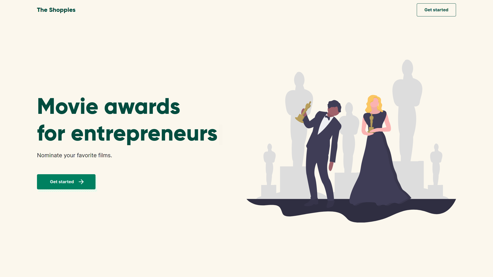
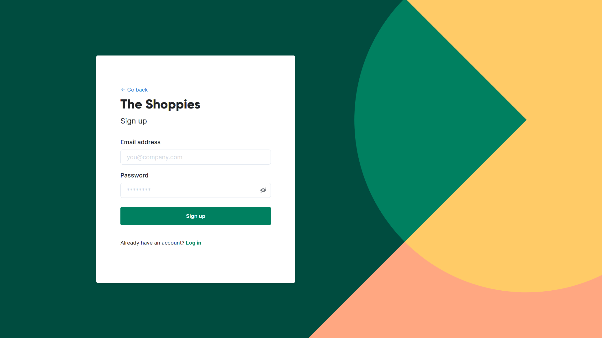
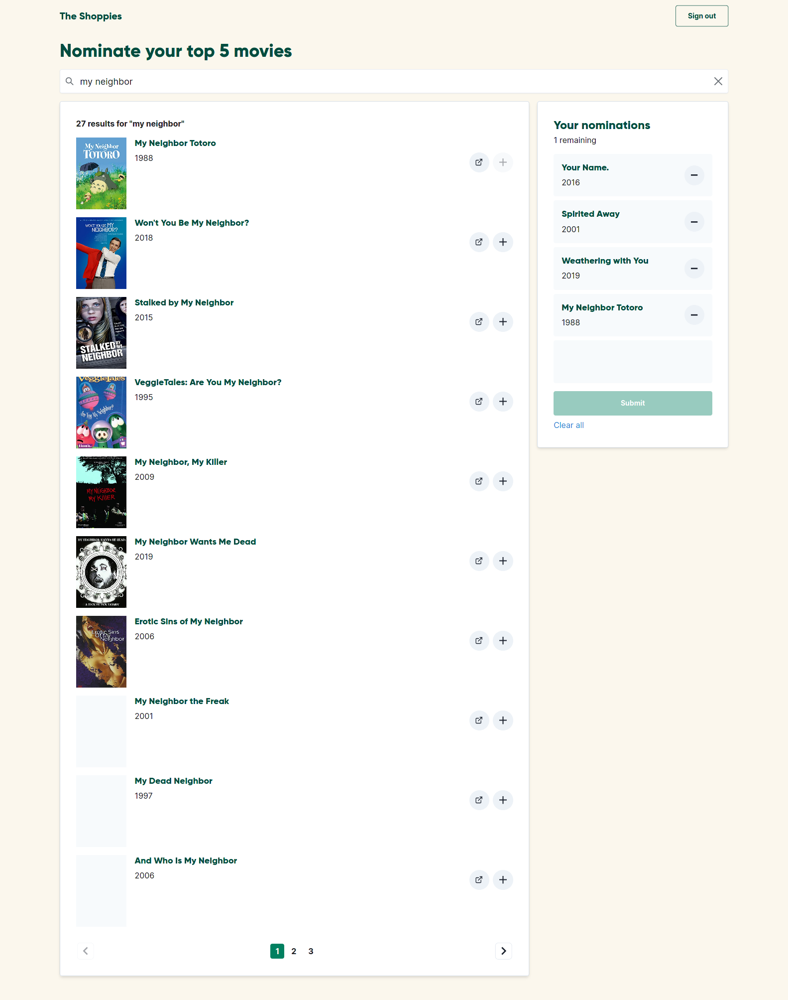

<h1 align="center">
The Shoppies
<br />
Movie awards for entrepreneurs
</h1>



<p align="center"><sup><i>Home page</i></sup></p>

The Shoppies is my submission for the Shopify UX Developer & Web Developer Intern challenge for Summer 2021.
Check it out at [shopify.tommydeng.com](https://shopify.tommydeng.com/).

## The Challenge

The main objectives were to complete the following.

> We need a webpage that can search OMDB for movies, and allow the user to save their favourite films they feel should be up for nomination. When they've selected 5 nominees they should be notified they're finished.
>
> We'd like a simple to use interface that makes it easy to:
> - Search OMDB and display the results (movies only)
> - Add a movie from the search results to our nomination list
> - View the list of films already nominated
> - Remove a nominee from the nomination list
>
> **Technical requirements**
>
> 1. Search results should come from OMDB's API (free API key: http://www.omdbapi.com/apikey.aspx).
> 2. Each search result should list at least its title, year of release and a button to nominate that film.
> 3. Updates to the search terms should update the result list
> 4. Movies in search results can be added and removed from the nomination list.
> 5. If a search result has already been nominated, disable its nominate button.
> 6. Display a banner when the user has 5 nominations.

In addition to these requirements, saving nomination lists to a database was implemented so users can keep their data if they leave the page.

## Hosting

The project is hosted on [Firebase Hosting](https://firebase.google.com/products/hosting/) at [shopify.tommydeng.com](https://shopify.tommydeng.com/).
There is continuous deployment from the repo to Firebase using GitHub Actions.

## Preview

Please visit [shopify.tommydeng.com](https://shopify.tommydeng.com/) or see the [docs/images/](docs/images/) folder for screenshots.



<p align="center"><sup><i>Sign up page</i></sup></p>



<p align="center"><sup><i>Full page screenshot of nominate page</i></sup></p>

## Technologies Used

- Chakra UI
- Firebase Authentication
- Firebase Cloud Firestore
- Firebase Hosting
- GitHub Actions
- Next.js
- Node.js
- TypeScript

## Getting Started

Clone this repo and run `npm install` while in the repo root directory to install project dependencies.

There are eight commands available:

```
# start a development server:
npm run dev

# create a production build:
npm run build

# start a production server:
npm start

# export to static HTML
npm run export

# typecheck TypeScript
npm run typecheck

# format with Prettier
npm run format

# check for issues with ESLint
npm run lint

# fix linting issues with ESLint
npm run lint-fix
```

## Art Credits

- [Hero graphic](src/components/svgs/undraw_awards_fieb.svg) from [unDraw](https://undraw.co/)
- Sign up and log in background asset and inspiration from [Shopify Accounts](https://accounts.shopify.com/)
- General colors from [Shopify](https://www.shopify.com/)

## License

[MIT License](LICENSE)
